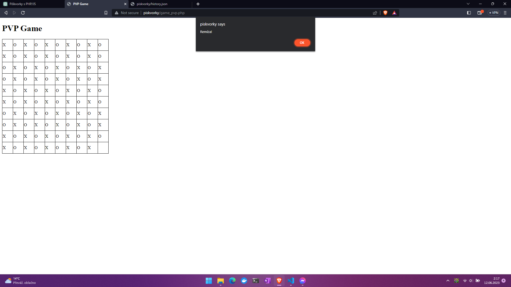

# Piškvorky

Hra piškvorky anglicky tic-tac-toe spočívá v označení 3 polí svým znakem "X" nebo "O" v diagonálním nebo vertikálním a nebo horizontálním směru.

## index.php

Obsahuje úvodní stránku, kde si volíme zda chceme hrát PVP (proti hráči) nebo PVE (proti počítači neboli AI).

## functions.php

Obsahuje funkci s for cyklem pro generování herního pole 10x10 polí.

## game_pvp.php a scriptPVP.js 

### game_pvp.php

Zde máme základní html strukturu a voláme zde funkci generateBoard() pro generování herního pole a skript pro ovládání hry.

### scriptPVP.js

Na základě hráčů vkládá do herního pole znaky "X" a "O". Dále po každém tahu kontroluje pole zda diagonálním nebo vertikálním a nebo horizontálním směrem nejsou 3 stejné znaky pokud ano zahlásí, který z hráčů to vyhrál. Pokud se jim však nepodaří ani jednomu vyhrát zápas končí remízou.

