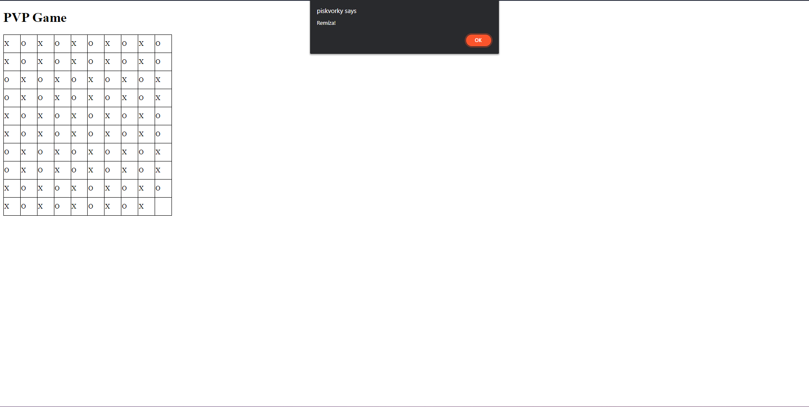

# Piškvorky

Hra piškvorky anglicky tic-tac-toe spočívá v označení 3 polí svým znakem "X" nebo "O" v diagonálním nebo vertikálním a nebo horizontálním směru.

## index.php

Obsahuje úvodní stránku, kde si volíme zda chceme hrát PVP (proti hráči) nebo PVE (proti počítači neboli AI).

## functions.php

Obsahuje funkci s for cyklem pro generování herního pole 10x10 polí.

## game_pvp.php a scriptPVP.js 

### game_pvp.php

Zde máme základní html strukturu a voláme zde funkci generateBoard() pro generování herního pole a skript pro ovládání hry.

### scriptPVP.js

Na základě hráčů vkládá do herního pole znaky "X" a "O". Dále po každém tahu kontroluje pole zda diagonálním nebo vertikálním a nebo horizontálním směrem nejsou 3 stejné znaky pokud ano zahlásí, který z hráčů to vyhrál. Pokud se jim však nepodaří ani jednomu vyhrát zápas končí remízou.

## game_pve.php, ai.php, scriptPVE.js, history.php, history.json, board.json a currentBoard.json

### game_pvp.php

Opět pomocí funkce generateBoard() generujeme herní pole a ovládáni AI.

### ai.php

Jak z názvu vyplývá je zde AI, které je bohužel nekompletní (napsat komplexní AI by trvalo dlouho a tak se samozřejmě bude dále vyvýjet). AI si vyyčítá data ze souboru currentBoard.json o aktualnám stavu herního pole, dále vyčíta data ze souboru history.json pro své zdokonalení. Je v něm implementována logiga hry.

### history.php 

Generuje historii her do souboru history.json v přehledném formátu (bohužel výhry AI označuje jako NULL - zatím se nepodařilo vyřešit).

### scriptPVE.js

Na základě hráče označí pole znakem "X" a pole vyhrané pomocí AI jako "O". Také po každém tahu oveřuje zda už některý z hráču nevyhrál. Spouští soubor history.php automaticky po ukončení hry a hlásí, který z hráčů vyhrál. Je to tedy rozšířená verze scriptPVP.js, která umí spouštět soubory a to soubor history.php a AI.php na základě interakce s hráčem

### history.json

Zde je uložena historie odehraných her proti AI každý zápas je uložen pod klíčem match a číslem hry např. match50, každý z nich ješte obsahuje klíč board který obsahuje zaznamenané pole na konci zápasu a klíč result s výsledkem, který hráč vyhrál. Bohužel AI se generuje jako null misto "O" (v budoucnu bude opraveno).

### board.json

Je zde pro scriptPVE.js a history.php aby dokázali ukládat data do souboru history.json.

### currentBoard.json

Zde se ukládá historie aktuálního hracího pole pro lepší uvažování "REALTIME" našeho AI. (Obávám se že také zatím ne uplně funkční.)